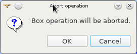

.. _introduction:

Introduction to SHAPER
======================

Application desktop
-------------------

The main window of the application consists of the following components:

- :ref:`main_menu`
- :ref:`doc_windows`
- :ref:`viewer` 

.. _main_menu:

Main menu 
---------

Main menu provides access to all commands of the application.

.. _doc_windows:

Dock windows
------------

Standard dock windows are: 

- :ref:`object_browser`
- :ref:`inspection_panel`
- :ref:`python console`
- :ref:`property_panel`

Dock windows can be placed in three dock areas:
- left, 
- right, 
- bottom.

By default object browser window is placed at left area of the main window  and Python console is placed as at bottom area of the main menu. 
user can close any dock window. To open it again he can use a corresponded command from pop-up menu on static part of main menu  

.. _object_browser: 

Object browser
^^^^^^^^^^^^^^

.. _property_panel:

Property panel
^^^^^^^^^^^^^^

By default Property Panel is hidden.

The Property Panel is shown on operation start at left side of the main window by default.

If Object Browser is shown at the same side then they will be tabbed.

Property panel consists of two parts:

- controls container for input of parameters for the current operation;
- buttons panel containing standard buttons:
    
  - **Ok/Apply** executes operation with defined parameters,
  - **Cancel/Close** calls **Abort operation** dialog box to confirm  operation abort,
  - **Help** calls User's guide opened on page describing the current operation.

.. centered::
   **OK**  button

.. image:: button_cancel.png
   :align: center

.. centered::
   **Cancel**  button

.. centered::
   **Help**  button

.. centered::
   **Abort operation** dialog box

 **OK**  button is disabled if not all input parameters are defined or some errors are found. Error is shown as tooltip and in inspection panel.

.. _inspection_panel: 

Inspection panel 
^^^^^^^^^^^^^^^^

.. _python console:

Python console
^^^^^^^^^^^^^^

.. _viewer:

Viewer
------

The application  supports one OCC viewer and is able to show only one 3D space.

This 3d space can be represented in several view windows.

Each of view windows represents its own point of view on the 3d scene.

This point of view can be modified by user with help of viewer commands like panning, zooming, scaling and so on.

Architecture and functionality of viewer is very similar to OCCViewer component from SALOME. 
