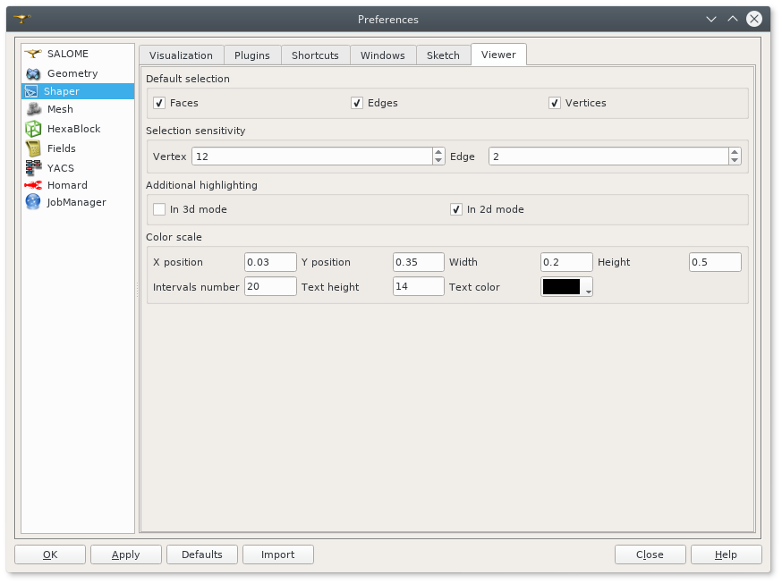

.. _introduction:

Introduction to SHAPER
======================

SHAPER module of SALOME is destined for:

- import and export of geometrical models in IGES, BREP, STEP and XAO formats;
- parametrical construction of geometrical objects using a wide range of functions;
    
  - creation of complex 2D sections using :ref:`sketchPlugin` with consequent extrusion or revolution :ref:`featuresPlugin`;
  - construction of model using primitives defined in  :ref:`primitivesPlugin`;
  - usage of Boolean operations :ref:`featuresPlugin`;
  
- viewing geometrical objects in the OCC viewer;
- transformation of geometrical objects using various algorithms.

It is possible to easily set :ref:`parameters` predefined to be used as arguments when objects are created.

SHAPER module preferences are described in the SHAPER :ref:`preferences` section of SALOME Help.

Almost all SHAPER  module functionalities are accessible via Python Interface.

SHAPER module works with one study containing several documents:

- partset
- one or several parts.

Only one document can be active.
  
New study contains only Partset with 7 default constructions which cannot be deleted:
  
- one point **Origin** coincing with origin of coordinate system;
- three axes **OX**, **OY**, **OZ**  coinciding with coordinate axes;
- three planes **YOZ**, **XOZ**, **XOY**  coinciding with coordinate planes.    

Only  points, axis and plane (see  :ref:`constructionPlugin`) and sketches (see  :ref:`sketchPlugin`) can be added in Partset to be used in any part later.
:ref:`parameters` created can be also used both in Partset and any Part.

If parameter name in Partset and  Part are identical then Part parameter has higher prority.
     
New Part can be created as described in :ref:`partPlugin`.

Double click or pop-up menu can be used to activate existing document.

Application desktop
-------------------

The main window of the application consists of the following components:

- :ref:`main_menu`;
- :ref:`doc_windows`;
- :ref:`viewer`;
- status bar.    

.. centered::
   Main window of SHAPER module

  
.. _main_menu:

Main menu 
---------

Main menu provides access to all commands of the application.

.. image:: images/main_menu.png
   :align: center

.. centered::
   Main menu

Main menu includes standard Salome items:

- File;
- Edit;
- View;
- Tools;   
- Window;
- Help;
    
and items specific for SHAPER module:

- :ref:`partPlugin`;
- :ref:`sketchPlugin`;
- :ref:`constructionPlugin`;
- :ref:`buildPlugin`;
- :ref:`primitivesPlugin`;
- :ref:`gdmlPlugin`;
- :ref:`featuresPlugin`;  
- Macros. 

  
.. _doc_windows:

Dock windows
------------

Standard dock windows are: 

- :ref:`object_browser`
- :ref:`inspection_panel`
- :ref:`python console`
- :ref:`property_panel`

Dock windows can be placed in three dock areas:
  
- left, 
- right, 
- bottom.

By default object browser window is placed at the left  dock area, Inspection panel at the right  dock area and Python console at the bottom dock area of the main window and Property Panel is hidden.

The Property Panel is shown on operation start at left dock area of the main window by default.

If Object Browser is shown at the same side then they will be tabbed.

Each dock window can be closed using **Cross** window button and opened again using a corresponding command from **View - Windows** :ref:`main_menu` or alternatively using pop-up menu.

.. image:: images/popup_menu.png
   :align: center

.. centered::
   Pop-up menu for visibilty of windows and toolbars

.. _object_browser: 

Object browser
^^^^^^^^^^^^^^

Object browser contains all documents created in the active study shown in Tree View.

Partset includes the following branches:

- Parameters;
- Constructions;
- Features    

Part includes the following branches:

- Parameters;
- Constructions;
- Results;
- Fields;
- Groups;   
- Features.    

New part contains only 3 empty branches:
 
- Parameters;
- Constructions;
- Results; 

.. _property_panel:

Property panel
^^^^^^^^^^^^^^

By default Property Panel is hidden.

The Property Panel is shown on operation start at left side of the main window by default.

If Object Browser is shown at the same side then they will be tabbed.

Property panel consists of two parts:

- controls container for input of parameters for the current operation;
- buttons panel containing standard buttons:
    
  - **Ok/Apply** executes operation with defined parameters,
  - **Cancel/Close** calls **Abort operation** dialog box to confirm  operation abort,
  - **Help** calls User's guide opened on page describing the current operation.

.. centered::
   **OK**  button

.. image:: images/button_cancel.png
   :align: center

.. centered::
   **Cancel**  button

.. image:: images/button_help.png
   :align: center

.. centered::
   **Help**  button

.. centered::
   **Abort operation** dialog box

**OK**  button is disabled if not all input parameters are defined or some errors are found. Error is shown as tooltip and in status bar.

.. _inspection_panel: 

Inspection panel 
^^^^^^^^^^^^^^^^

.. _python console:

Python console
^^^^^^^^^^^^^^

.. _viewer:

Viewer
------

The application supports one OCC 3D viewer and is able to show only one 3D space.

Architecture and functionality of OCC 3D Viewer is provided in GUI module user's guide in chapter **OCC 3D Viewer**.

This 3D space can be represented in several view windows. New view window can be created using **Clone view** button in viewer toolbar.

Each of view windows represents its own point of view on the 3D scene.

This point of view can be modified by user with help of viewer commands like **Panning**, **Zooming**, **Scaling** and so on.

.. centered::
   Two view windows

  
.. _parameters:

Parameters
---------

Parameter
^^^^^^^^^

.. _preferences:

SHAPER preferences
------------------

Visualization tab
^^^^^^^^^^^^^^^^^

.. image:: images/visualization_preferences.png
   :align: center

.. centered::
   Preferences - Visualization tab

Plugins tab
^^^^^^^^^^^

.. image:: images/plugins_preferences.png
   :align: center

.. centered::
   Preferences - Plugins tab

Sketch tab
^^^^^^^^^^

.. centered::
   Preferences - Sketch tab

Viewer tab
^^^^^^^^^^

.. centered::
   Preferences - Viewer tab   
