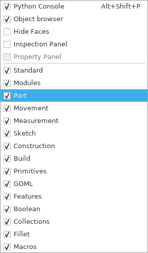
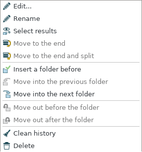
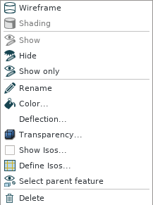
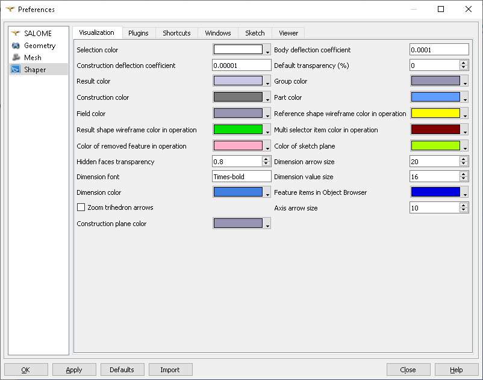
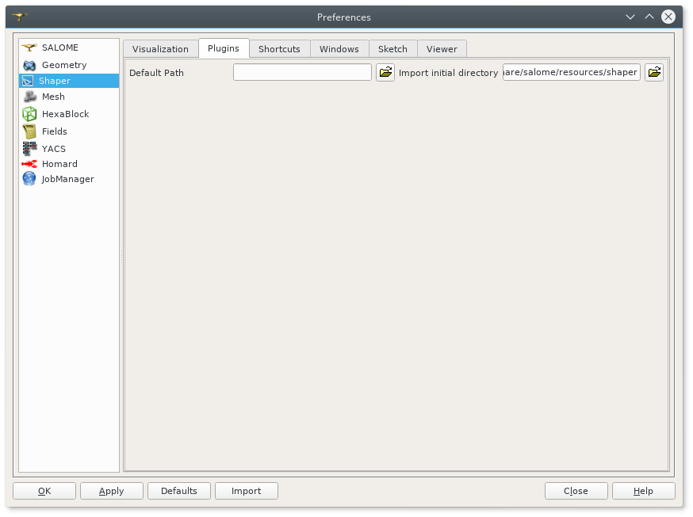

.. _introduction:

Introduction to SHAPER
======================

SHAPER module of SALOME is destined for:

- import and export of geometrical models in IGES, BREP, STEP and XAO formats;
- parametrical construction of geometrical objects using a wide range of functions;
    
  - creation of complex 2D sections using :ref:`sketchPlugin` with consequent extrusion or revolution :ref:`featuresPlugin`;
  - construction of model using primitives defined in  :ref:`primitivesPlugin`;
  - usage of Boolean operations :ref:`featuresPlugin`;
  
- viewing geometrical objects in the OCC viewer;
- transformation of geometrical objects using various algorithms.

It is possible to easily set :ref:`parameters` predefined to be used as arguments when objects are created.

SHAPER module preferences are described in the SHAPER :ref:`preferences` section of SALOME Help.

Almost all SHAPER  module functionalities are accessible via Python Interface.

SHAPER module works with one study containing several documents:

- partset
- one or several parts.

Only one document can be active.
  
New study contains only Partset with 7 default constructions which cannot be deleted:
  
- one point **Origin** coincing with origin of coordinate system;
- three axes **OX**, **OY**, **OZ**  coinciding with coordinate axes;
- three planes **YOZ**, **XOZ**, **XOY**  coinciding with coordinate planes.    

Only  points, axis and plane (see  :ref:`constructionPlugin`) and sketches (see  :ref:`sketchPlugin`) can be added in Partset to be used in any part later.
:ref:`parameters` created can be used both in Partset and any Part.

If parameter name in Partset and  Part are identical then Part parameter has higher prority.
     
New Part can be created as described in :ref:`partPlugin`.

Double click or pop-up menu can be used to activate existing document.

Application desktop
-------------------

The main window of the application consists of the following components:

- :ref:`main_menu`;
- :ref:`doc_windows`;
- :ref:`viewer`;
- status bar.    

.. image:: images/main_window.png
   :align: center

.. centered::
   Main window of SHAPER module

  
.. _main_menu:

Main menu 
---------

Main menu provides access to all commands of the application.

.. centered::
   Main menu

Main menu includes standard Salome items:

- File;
- Edit;
- View;
- Tools;   
- Window;
- Help;
    
and items specific for SHAPER module:

- :ref:`partPlugin`;
- :ref:`sketchPlugin`;
- :ref:`constructionPlugin`;
- :ref:`buildPlugin`;
- :ref:`primitivesPlugin`;
- :ref:`gdmlPlugin`;
- :ref:`featuresPlugin`;  
- Macros. 

  
.. _doc_windows:

Dock windows
------------

Standard dock windows are: 

- :ref:`object_browser`
- :ref:`inspection_panel`
- :ref:`python console`
- :ref:`property_panel`

Dock windows can be placed in three dock areas using drag-and -drop:
  
- left, 
- right, 
- bottom.

By default object browser window is placed at the left dock area, Inspection panel at the right dock area and Python console at the bottom dock area of the main window.

Property Panel is hidden.

The Property Panel is shown on operation start at left dock area of the main window by default.

If Object Browser is shown at the same side then they will be tabbed.

Each dock window can be closed using **Cross** window button and opened again using a corresponding command from **View - Windows** :ref:`main_menu` or alternatively using pop-up menu.

.. centered::
   Pop-up menu for visibilty of windows and toolbars

.. _object_browser: 

Object browser
^^^^^^^^^^^^^^

Object browser contains all documents created in the current study. shown in Tree View.

Each document includes standard branches where created objects are placed.

Documents with branches are shown in Tree View.

.. centered::
   Object browser. Partset active

Partset includes three branches:

- Parameters;
- Constructions;
- Features    

Part includes the following branches:

- Parameters;
- Constructions;
- Results;
- Fields;
- Groups;   
- Features.    

New part contains only 3 empty branches:
 
- Parameters;
- Constructions;
- Results.

Features are placed one after another in the active document with default names and their results are placed in the corresponding branch.

Each feature, result, construction, group, field, parameter can be renamed using *Rename* pop-up menu command.

.. centered::
   Feature pop-up menu

.. centered::
    Result pop-up menu

.. centered::
   Construction pop-up menu

Order of featurs can be changed using *Move to the end* pop-up menu command. Selected feature will be moved to the end of feture list.

Folders can be used to arrange long Tree View for features.

.. centered::
   Object browser with folder Dome. Part_1 active

*Insert a folder before* pop-up menu command creates a new empty folder before the selected feature. Folder can be renamed.

Features placed after/before the created folder can be moved into the folder using *Move into the previous folder* / *Move into the next folder* pop-up menu command.

This allows to decrease length of feature list.

Features can be removed from folder back using *Move out before the folder* / *Move out after the folder* pop-up menu command.

*Clean history* pop-up menu command looks for features that do not participate in other features.

**Clean history** dialog box shows list of unused features. After confirmation by click **Yes** button unused features are removed.

.. centered::
   **Clean history** dialog box

*Select result* and *Select parent feature* pop-up menu commands help to navigate along Tree View.

Feature together with its result can be deleted using *Delete* pop-up menu command.

Note that all features using removed feature and their results will be removed simulteneously.

**Delete feature** dialog box shows list of feature to be removed. After confirmation by click **Yes** button all these features are removed.

.. centered::
   **Delete feature** dialog box
   
.. _property_panel:

Property panel
^^^^^^^^^^^^^^

By default Property Panel is hidden.

The Property Panel is shown on operation start at left side of the main window by default.

If Object Browser is shown at the same side then they will be tabbed.

Property panel consists of two parts:

- controls container for input of parameters for the current operation;
- buttons panel containing standard buttons:
    
  - **Ok/Apply** executes operation with defined parameters,
  - **Cancel/Close** calls **Abort operation** dialog box to confirm  operation abort,
  - **Help** calls User's guide opened on page describing the current operation.

.. image:: images/button_ok.png
   :align: center

.. centered::
   **OK**  button

.. image:: images/button_cancel.png
   :align: center

.. centered::
   **Cancel**  button

.. image:: images/button_help.png
   :align: center

.. centered::
   **Help**  button

.. image:: images/abort_operation.png
   :align: center

.. centered::
   **Abort operation** dialog box

**OK**  button is disabled if not all input parameters are defined or some errors are found. Error is shown as tooltip and in status bar.

.. _inspection_panel: 

Inspection panel 
^^^^^^^^^^^^^^^^

Inspection panel provides the list of types and quantities of all topological entities, composing the selected result, consruction  or feature.

.. centered::
   Inspection panel for default Box

**Object** displays name of the selected result, consruction  or feature.

**Type** characterizes the whole shape.
   
The information about Point, Axis or Edge  additionally shows coordinates of point / end points.

.. centered::
   Inspection panel for Axis
   

The information about  Plane, Face additionally shows coordinates of center point and direction of normal.

.. centered::
   Inspection panel for Face 

 

.. _python console:

Python console
^^^^^^^^^^^^^^

Python console interpreters Python commands entered manually.

In particular, it is possble to load python script:

*execfile(r"/dn48/newgeom/data/example.py")*

Pop-up menu allows:

- Copy selected text to clipboard;
- Paste text from clipboard to Python console ;
- Clear Python console;
- Dump commands from console into the specified file;
- Start/Stop writing log into the specified file.    
 

.. centered::
   Pop-up menu of Python console

.. _viewer:

Viewer
------

The application supports one OCC 3D viewer and is able to show only one 3D space.

This 3D space can be represented in several view windows. New view window can be created using **Clone view** button in viewer toolbar.

Each of view windows represents its own point of view on the 3D scene.

This point of view can be modified by user with help of viewer commands like **Panning**, **Zooming**, **Scaling** and so on.

.. image:: images/2_viewers.png
   :align: center

.. centered::
   Two view windows

Description of OCC 3D Viewer architecture and functionality is provided in GUI module user's guide in chapter **OCC 3D Viewer**.

.. _parameters:

Parameters
---------

Parameter
^^^^^^^^^

.. _preferences:

SHAPER preferences
------------------

Visualization tab
^^^^^^^^^^^^^^^^^

.. centered::
   Preferences - Visualization tab

Plugins tab
^^^^^^^^^^^

.. centered::
   Preferences - Plugins tab

Sketch tab
^^^^^^^^^^

.. image:: images/sketch_preferences.png
   :align: center

.. centered::
   Preferences - Sketch tab

Viewer tab
^^^^^^^^^^

.. image:: images/viewer_preferences.png
   :align: center

.. centered::
   Preferences - Viewer tab   
