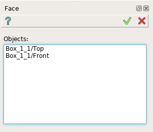
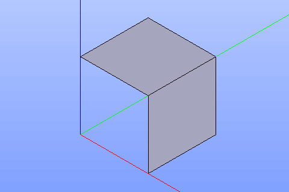

Face
====

To create face in the active part:

#. select in the Main Menu *Build - > Face* item  or
#. click **Face** button in the toolbar

.. centered::
  **Face** button

The following property panel will be opened:
   

.. centered::
  Create a face
  
Select one or several faces in viewer.

**Apply** button creates faces.

**Cancel** button cancels operation. 

The result of the operation will be set of faces created from selected shapes:

.. centered::
  Result of the operation.

**See Also** a sample TUI Script of a :ref:`tui_create_face` operation.
