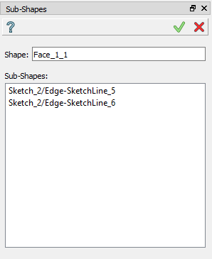

Sub-shapes
==========

The feature **Sub-shapes** creates sub-shapes of selected entity.

To create Sub-shapes in the active part:

#. select in the Main Menu *Build - > Sub-shapes* item  or
#. click **Sub-shapes** button in the toolbar

.. centered::
   **Sub-shapes** button 

The following property panel appears.

.. centered::
  Sub-shapes property panel

Input fields:

- **Shape** panel contains shape to be modified. Shape is selected in 3D OCC viewer or object browser;
- **Sub-shapes** panel contains list of sub-shapes of given shape to be included into result. Sub-shapes are selected in 3D OCC viewer.

**TUI Command**:  *model.addSubShapes(Part_doc, shape, sub-shapes)*

**Arguments**: 1 part + shape in format *model.selection(TYPE, shape)* + list of sub-shapes in format *model.selection(TYPE, subshape)*.

Result
""""""
Result of operation is shown below.

.. centered::
   Sub-shapes

**See Also** a sample TUI Script of a :ref:`tui_create_subshape` operation.

  

