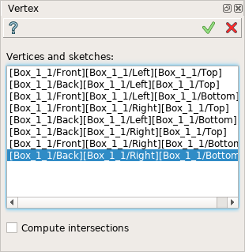
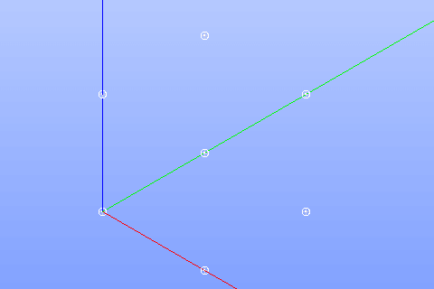

Vertex
======

To create vertices in the active part:

#. select in the Main Menu *Build - > Vertex* item  or
#. click **Vertex** button in the toolbar

.. centered::
  **Vertex** button

The following property panel will be opened:

.. centered::
  Create vertices

Select one or several vertices in viewer.

**Apply** button creates vertices.

**Cancel** button cancels operation. 

The result of the operation will be set of vertices created from selected shapes:

.. centered::
  Result of the operation.

**See Also** a sample TUI Script of a :ref:`tui_create_vertex` operation.
