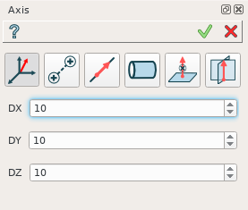

Axis
====

Axis is a construction object and it can be created as in a part as in part set. To create an axis:

#. select in the Main Menu *Construction - > Axis* item  or
#. click **Axis** button in the toolbar

.. centered::
  **Axis** button

There are 6 algorithms for creation of an Axis:

	
.. centered::
   **By dX, dY, dZ values**

In this case user has to define dX, dY, dZ values of a vector.

	
.. centered::
   **By two points**

In this case user has to select two points or vertices.

	
.. centered::
   **By a line**

In this case user has to select a linear edge.

	
.. centered::
   **By a cylinder**

In this case user has to select a cylindrical face. Axis of the cylinder will define an axis object.

	
.. centered::
   **By a plane and point**

In this case user has to select a point or vertex and plane (or planar face). Axis will be defined as a normal from the point to the plane.

	
.. centered::
   **By two planes**

In this case user has to select two planes. Intersection of that planes defines an axis. User can define offset for axis definition from both planes.

**TUI Commands**:

#. *model.addAxis(Part_doc, 10, 10, 10)*  **Arguments**: Part + 3 values (dX, dY, dZ values).
#. *model.addAxis(Part_doc, model.selection("VERTEX", "Box_1_1/Back&Box_1_1/Left&Box_1_1/Top"), model.selection("VERTEX", "Box_1_1/Front&Box_1_1/Right&Box_1_1/Bottom"))*  **Arguments**: Part + 2 vertices.
#. *model.addAxis(Part_doc, model.selection("EDGE", "Box_1_1/Left&Box_1_1/Top"))*  **Arguments**: Part + edge.
#. *model.addAxis(Part_doc, model.selection("FACE", "Cylinder_1_1/Face_1"))*  **Arguments**: Part + cylindrical face.
#. *model.addAxis(Part_doc, model.selection("FACE", "Box_1_1/Front"), model.selection("VERTEX", "Box_1_1/Back&Box_1_1/Right&Box_1_1/Top"))*   **Arguments**: Part + plane + point.
#. *model.addAxis(Part_doc, model.selection("FACE", "Box_1_1/Top"), 5, False, model.selection("FACE", "Box_1_1/Front"), 3, False)*  **Arguments**: Part + plane + offcet value + is reversed flag + plane + offcet value + is reversed flag.

The Result of the operation will be an axis:

.. image:: images/CreatedAxis.png
	   :align: center

.. centered::
   Axis created  

**See Also** a sample TUI Script of a :ref:`tui_create_axis` operation.
