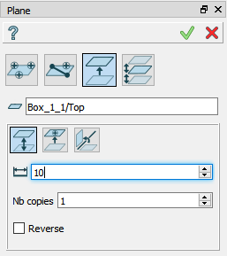
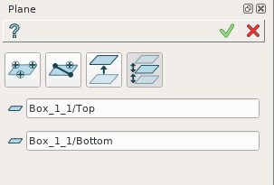

Plane
=====

Plane is a construction object and it can be created as in a part as in part set. To create a plane:

#. select in the Main Menu *Construction - > Plane* item  or
#. click **Point** button in the toolbar

.. centered::
  **Plane** button

There are 4 algorithms for creation of a Plane:

	
.. centered::
   **By three points**

In this case user has to select three points in a viewer to define a new plane.

	
.. centered::
   **Line and point**

In this case user has to select a linear edge and point to define a plane. It is possible to make the new plane perpendicular to the selected edge.

	
.. centered::
   **By other plane**

In this case user has to select an already existing plane (planar face). There are following possibilities to define a new plane:

#. By distance from the selected plane.
#. By coincidence to a point.
#. By rotation around an edge on a specified angle.

	
.. centered::
   **By two parallel planes**

In this case user has to select two parallel planes. A new plane will be defined between them.

**TUI Commands**:

#. *model.addPlane(Part_doc, model.selection("VERTEX", "Box_1_1/Back&Box_1_1/Left&Box_1_1/Top"), model.selection("VERTEX", "Box_1_1/Front&Box_1_1/Right&Box_1_1/Top"), model.selection("VERTEX", "Box_1_1/Front&Box_1_1/Left&Box_1_1/Bottom"))*  **Arguments**: Part + 3 vertices.
#. *model.addPlane(Part_doc, model.selection("EDGE", "Box_1_1/Left&Box_1_1/Top"), model.selection("VERTEX", "Box_1_1/Front&Box_1_1/Right&Box_1_1/Bottom"), False)*  **Arguments**: Part + line + point + is perpendicular to line flag.
#. *model.addPlane(Part_doc, model.selection("FACE", "Box_1_1/Front"), 10, False)*  **Arguments**: Part + a plane + offset + is reverse flag.
#. *model.addPlane(Part_doc, model.selection("FACE", "Box_1_1/Left"), model.selection("FACE", "Box_1_1/Right"))*  **Arguments**: Part + 2 planes.

The Result of the operation will be a plane:

.. image:: images/CreatedPlane.png
	   :align: center

.. centered::
   Plane created  

**See Also** a sample TUI Script of a :ref:`tui_create_plane` operation.
