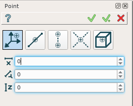
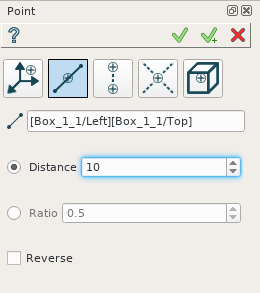
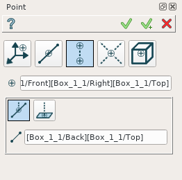
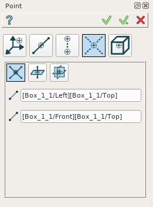
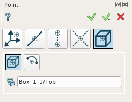

Point
=====

Point is a construction object and it can be created as in a part as in part set. To create a point:

#. select in the Main Menu *Construction - > Point* item  or
#. click **Point** button in the toolbar

.. centered::
  **Point** button

There are 5 algorithms for creation of a Point:

	
.. centered::
   **By X,Y,Z coordinates**

In this case user has to input X, Y, and Z coordinates.

	
.. centered::
   **Along an edge**

In this case user has to select an edge in a viewer and to define a distance along the edge where point will be defined. This distance can be defined as by an absolute value as by relative as a ratio to the edge length. The direction of the edge can be reverced by the corresponded check box.

	
.. centered::
   **By projection**

In this case user has to select an existing point or vertex and an edge or face. The new point will be created by projection of the selected point on the edge or face.

	
.. centered::
   **Intersection of objects**

In this case user has to select:

#. two edges,
#. edge and plane,
#. three planes

The new point will be defined by intersection of selected objects.

	
.. centered::
   **By geometrical property**

In this case the new point can be defined as a center of gravity of selected object or as a center of a circle. User has to select desirable object.

**TUI Commands**:

#. *model.addPoint(Part_doc, 50, 50, 50)*  **Arguments**: Part + 3 values (X, Y, Z coordinates).
#. *model.addPoint(Part_doc, model.selection("EDGE", "Box_1_1/Left&Box_1_1/Top"), 0.5, True, False)*  **Arguments**: Part + edge + value + is by ratio flag + to reverce flag.
#. *model.addPoint(Part_doc, model.selection("VERTEX", "Box_1_1/Front&Box_1_1/Left&Box_1_1/Top"), model.selection("EDGE", "Box_1_1/Right&Box_1_1/Top"))*   **Arguments**: Part + vertex + edge (or plane).
#. *model.addPoint(Part_doc, model.selection("EDGE", "Box_1_1/Front&Box_1_1/Top"), model.selection("FACE", "Box_1_1/Left"), 10, False)*   **Arguments**: Part + edge + plane (planar face) + offset value + is offcet reversed.
#. *model.addPoint(Part_1_doc, model.selection("SOLID", "Box_1_1"))*   **Arguments**: Part + solid

The Result of the operation will be a construction point:

.. image:: images/CreatePoint.png
	   :align: center

.. centered::
   Point created  

**See Also** a sample TUI Script of a :ref:`tui_create_point` operation.
