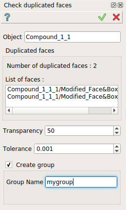

.. |duplicated_shapes.icon|    image:: images/duplicated_shapes.png

Check duplicated faces
======================

The **Check duplicated faces** feature find the duplicated faces within a composolid or compound.

The result is a list of faces. A group can be created with a name specified.

To check duplicated faces in the active part:

#. select in the Main Menu *Inspection - > Check duplicated faces* item  or
#. click |duplicated_shapes.icon| **Check duplicated faces** button in the toolbar

The property panel is shown below.

   Check duplicated faces

Input fields:

- **Object** contains composolid or compound selected in 3D OCC viewer or object browser.
- **Number of duplicated faces** indicate the number of found faces.
- **List of faces** the list of found faces.
- **Transparency** set the transparency of selected object.
- **Tolerance** set the tolerance for the algorithme.
- **Create group** check-box allow the creation with the group of found faces.
- **Group name**  specified the name of the group created.

**TUI Command**:

.. py:function:: model.getDuplicatedFaces(Part_doc, shape, tolerance, nameGroup)

    :param part: The current part object.
    :param object: A composolid or compound in format *model.selection("Type", shape)*.
    :param number: value of the tolerance.
    :param string: name of group created.
    :return: Created group.

Result
""""""

Result of **Check duplicated faces** where **Create group** is checked.

   Duplicated faces

**See Also** a sample TUI Script of :ref:`tui_duplicated_faces` operation.
