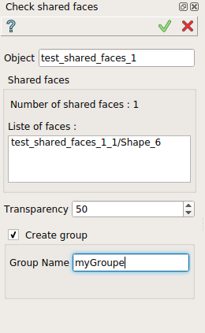
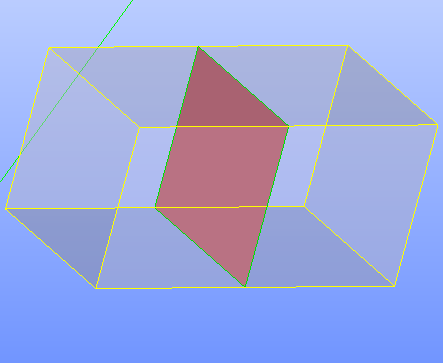

Check shared faces
==================

The **Check shared faces** feature find the shared faces of a composolid or compound.

The result is a list of faces and a group can be created with name specified.   

To check shared faces in the active part:

#. select in the Main Menu *Inspection - > Check shared faces* item  or
#. click |shared_shapes.icon| **Check shared faces** button in the toolbar

The property panel is shown below.

   Check shared faces

Input fields:

- **Object** contains composolid or compound selected in 3D OCC viewer or object browser. 
- **Number of shared faces** indicate the number of found faces. 
- **List of faces** the list of found faces.
- **Transparency** set the transparency of selected object.   
- **Create group** check-box allow the creation of the group of found faces. 
- **Group name**  specified the name of the group created. 

**TUI Command**:

.. py:function:: model.getSharedFaces(Part_doc, shape, transparency, nameGroup)
 
    :param part: The current part object.
    :param object: A composolid or compound in format *model.selection("Type", shape)*.
    :param number: value for the transparency.
    :param string: name of group created. 
    :return: Created group.

Result
""""""

Result of **Check shared faces** where **Create group** is checked.

   Shared faces

**See Also** a sample TUI Script of :ref:`tui_shared_faces` operation.