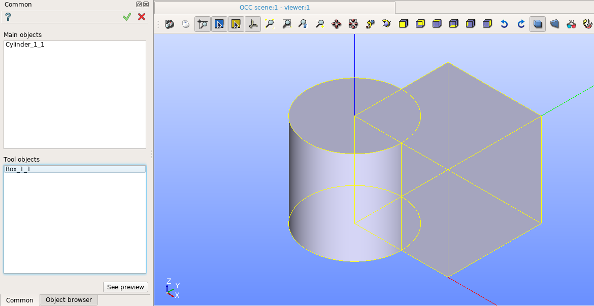
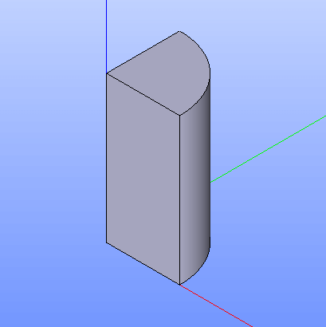

Common
======

To a create boolean opration Common in the active part:

#. select in the Main Menu *Features - > Common* item  or
#. click **Common** button in the toolbar

.. centered::
   **Common**  button 

The following property panel will be opened:
   

.. centered::
  **Common operation**

It is necessary to select main objects and tool objects.

**Apply** button creates the common shape.
  
**Cancel** button cancels operation.

**TUI Command**:  *model.addCommon(Part_doc, mainObjects, toolObjects)*

**Arguments**:   Part + list of main objects + list of tool objects.

The Result of the operation will be a shape which is a common for all selected shapes:

.. centered::
   **Common created**

**See Also** a sample TUI Script of a :ref:`tui_create_common` operation.
