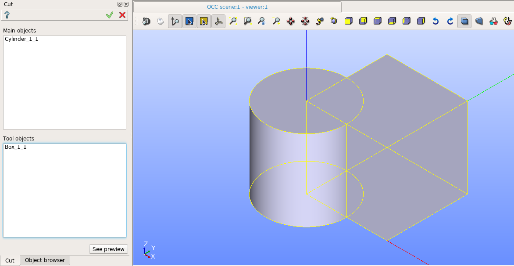
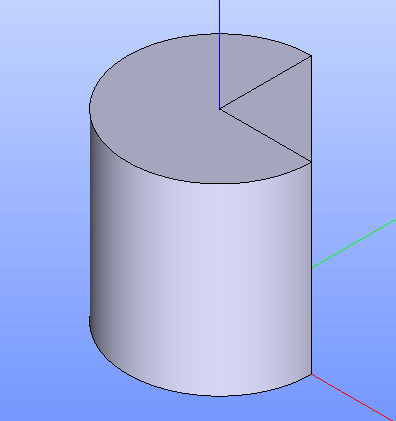

Cut
===

To a create boolean opration Cut in the active part:

#. select in the Main Menu *Features - > Cut* item  or
#. click **Cut** button in the toolbar

.. centered::
   **Cut**  button 

The following property panel will be opened:

.. centered::
  **Cut operation**

Here it is necessary to select main objects and tool objects.

**Apply** button creates the cut shape.
  
**Cancel** button cancels operation.

**TUI Command**:  *model.addCut(Part_doc, mainObjects, toolObjects)*

**Arguments**:   Part + list of main objects + list of tool objects.

The Result of the operation will be a shape which is a cut of tool objects from main objects:

.. centered::
   **Cut created**

**See Also** a sample TUI Script of a :ref:`tui_create_cut` operation.
