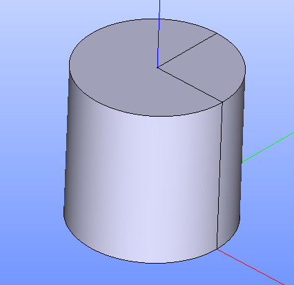

Fill
====

To a create boolean opration Fill in the active part:

#. select in the Main Menu *Features - > Fill* item  or
#. click **Fill** button in the toolbar

.. centered::
   **Fill**  button 

The following property panel will be opened:

.. image:: images/Fill.png
  :align: center

.. centered::
   **Fill operation**

Here it is necessary to select main objects and tool objects.

**Apply** button creates the fill shape.
  
**Cancel** button cancels operation.

**TUI Command**:  *model.addFill(Part_doc, mainObjects, toolObjects)*

**Arguments**:   Part + list of main objects + list of tool objects.

The Result of the operation will be a shape which is a fill of tool objects with main objects:

.. centered::
   **Fill created**

**See Also** a sample TUI Script of a :ref:`tui_create_fill` operation.
