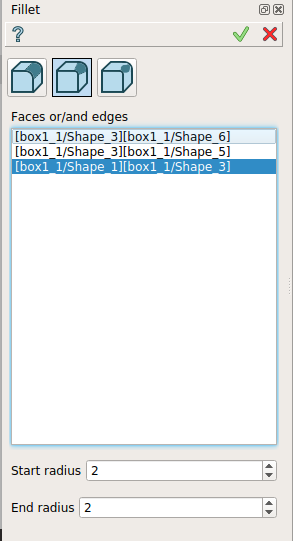

.. _featureFillet:

Fillet
======

**Fillet** feature creates fillets on the edges of a shape. 

To create a Fillet in the active part:

#. select in the Main Menu *Feature - > Fillet* item  or
#. click |fillet.icon| **Fillet** button in the toolbar

There are 3 types of fillet:

fillet by fixed radius

fillet by variable radius

fillet by multiple radius

--------------------------------------------------------------------------------

Fillet by fixed radius
----------------------

The  property panel is shown below.

   Fillet by fixed radius property panel

Input fields:

- **Faces, edges or/and solids** panel contains filleted faces, edges and solids. All edges of a face or solid are subject to fillet operation. Faces, edges and solids are selected in 3D OCC viewer;
- **Radius** defines fillet radius.

**TUI Command**:

.. py:function:: model.addFillet(Part_doc, [face,edge,solid], radius)

    :param part: The current part object.
    :param list: A list of faces, edges and solids subject to fillet operation in format *model.selection(TYPE, shape)*.
    :param number: Radius value.
    :return: Created object.

Result
""""""

Result of **Fillet by fixed radius** is shown below.

   Fillet by fixed radius

**See Also** a sample TUI Script of :ref:`tui_create_fillet1` operation.

Fillet by variable radius
-------------------------

Alternatively, there is a possibility to create a fillet with a variable radius.

   Fillet by variable radius

Input fields:

- **Faces or/and edges** panel contains filleted faces and edges. All edges of a face are subject to fillet operation. Faces and edges are selected in 3D OCC viewer;
- **Start radius** defines  the  fillet radius at the start of the selected edge(s);  
- **End radius** defines  the  fillet radius at the end of the selected edge(s).

**TUI Command**:

.. py:function:: model.addFillet(Part_doc,[face,edge], R1, R2)

    :param document Part_doc: The current part object.
    :param list: A list of faces and edges subject to fillet operation in format *model.selection(TYPE, shape)*.
    :param number: Start radius value.
    :param number: End radius value.
    :return: Created object.

Result
""""""

Result of **Fillet by variable radius** is shown below.

   Fillet by variable radius

**See Also** a sample TUI Script of :ref:`tui_create_fillet2` operation.

Fillet by multiple radius
-------------------------

There is a possibility to create a fillet with multiple radius define along an edge.

   Fillet by multiple radius

There are two methods for creating a fillet by multiple radius :

.. figure:: images/fillet_multiradius_by_curv.png   
   :align: left
   :height: 24px

Fillet with multiple radiuses by curvilinear abscissa

Fillet with multiple radiuses by points

Fillet with multiple radiuses by curvilinear abscissa
"""""""""""""""""""""""""""""""""""""""""""""""""""""
The  property panel is shown below.

   Fillet with multiple radiuses by curvilinear abscissa property panel

Input fields:

- **Edges or/and faces** panel contains filleted faces and edges. All edges of a face are subject to fillet operation. Faces and edges are selected in 3D OCC viewer;
- **Radii** table allows to define a radius for each selected abscissa along the selected edge(s);  
   - **Curvilinea Abscissa** contains the curvilinear abscissa of points on edge; 
   - **Radius** contains the radius for each point.

**TUI Command**:

.. py:function:: model.addFilletMultiRadius(Part_doc, [face,edge], [absc1,absc2,...], [r1,r2,...])

    :param document Part_doc: The current part object.
    :param list: A list of faces and edges subject to fillet operation in format *model.selection(TYPE, shape)*.
    :param list number: list of curvilinea abscissa.
    :param list number: list of radius value.
    :return: Created object.

Result
""""""

Result of **Fillet with multiple radiuses by curvilinear abscissa** is shown below.

   Fillet with multiple radiuses by curvilinear abscissa

**See Also** a sample TUI Script of :ref:`tui_create_fillet_MultiRadiusBycurvAbs` operation.

Fillet with multiple radiuses by points
"""""""""""""""""""""""""""""""""""""""
The property panel is shown below.

   Fillet with multiple radiuses by points property panel

Input fields:

- Selection panel contains one edge which has to be selected in 3D OCC viewer;
- **Radii** defines the radius along the selected edge;  
   - **Point**  column contains points on edge. These points have to selected in 3D OCC viewer;
   - **Radius** column contains the radius for each selected point.

**TUI Command**:

.. py:function:: model.addFilletMultiRadius(Part_doc, edge, [point],[r1,r2,...])

    :param document Part_doc: The current part object.
    :param edge: An edge subject to fillet operation in format *model.selection(TYPE, shape)*.
    :param list: list of point in format *model.selection(TYPE, shape)*.
    :param list number: list of radius value.
    :return: Created object.

Result
""""""

Result of **Fillet with multiple radiuses by points** is shown below.

   Fillet with multiple radiuses by points

**See Also** a sample TUI Script of :ref:`tui_create_filletMultiRadiusByPoints` operation.

