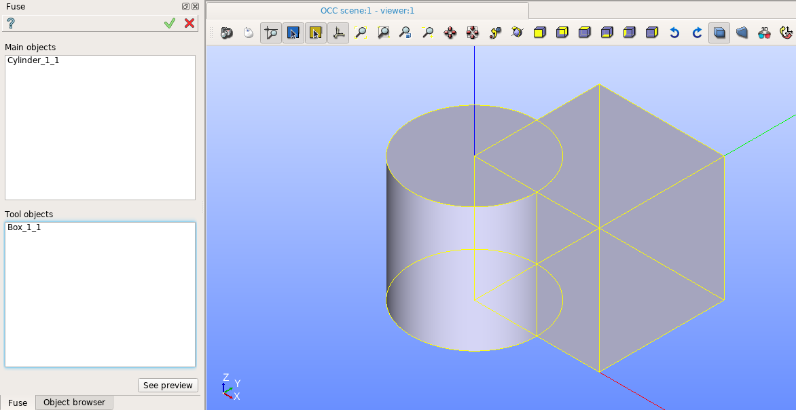
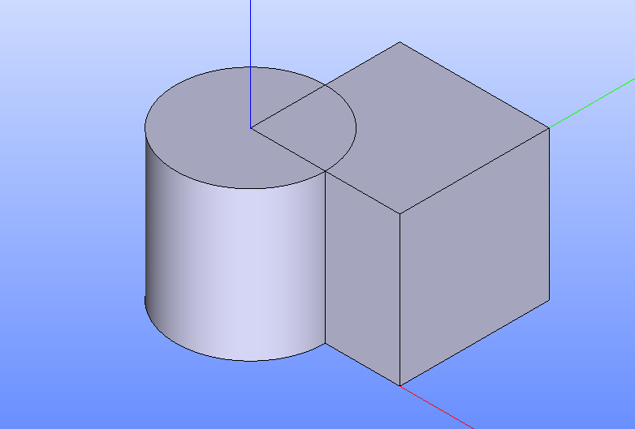

Fuse
====

To a create boolean opration Fuse in the active part:

#. select in the Main Menu *Features - > Fuse* item  or
#. click **Fuse** button in the toolbar

.. centered::
   **Fuse**  button 

The following property panel will be opened:

.. centered::
  **Fuse operation**

Here it is necessary to select main objects and tool objects.

**Apply** button creates the fuse shape.
  
**Cancel** button cancels operation.

**TUI Command**:  *model.addFuse(Part_doc, mainObjects, toolObjects)*

**Arguments**:   Part + list of main objects + list of tool objects.

The Result of the operation will be a shape which is a fuse of tool objects with main objects:

.. centered::
   **Fuse created**

**See Also** a sample TUI Script of a :ref:`tui_create_fuse` operation.
