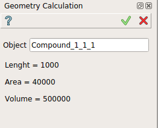

Geometry calculation
====================

The **Geometry calculation** feature displays basic properties of sub-elements of a geometrical object (shape).

The basic properties displayed in the property panel are lenght, area and volume.

**Apply** button does not generate any result and has the same effect as **Cancel** for this feature.  

To display basic properties in the active part:

#. select in the Main Menu *Inspection - > Geometry calculation* item  or
#. click |basicproperties.icon| **Geometry calculation** button in the toolbar

The basic properties can be displayed for a selected object in the property panel : 

   Geometry calculation

Input fields:

- **Object** contains an object selected in 3D OCC viewer or object browser. 

The basic properties displayed can be selected.
