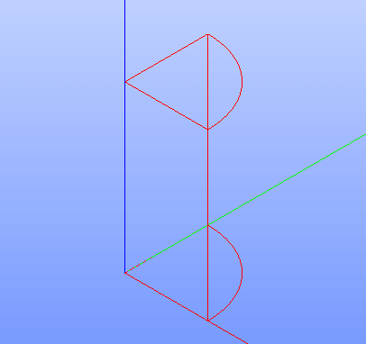

Intersection
============

To a create boolean opration Intersection in the active part:

#. select in the Main Menu *Features - > Intersection* item  or
#. click **Intersection** button in the toolbar

.. centered::
   **Intersection**  button 

The following property panel will be opened:

.. image:: images/Intersection.png
  :align: center

.. centered::
   **Intersection operation**

Here it is necessary to select some objects.

**Apply** button creates the intersection shape.
  
**Cancel** button cancels operation.

**TUI Command**:  *model.addIntersection(Part_doc, Objects)*

**Arguments**:   Part + list of objects.

The Result of the operation will be a shape which is an intersection of selected objects:

.. centered::
   **Intersection created**

**See Also** a sample TUI Script of a :ref:`tui_create_intersection` operation.
