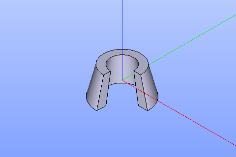

Cone
====

To create a Cone in the active part:

#. select in the Main Menu *GDML - > Cone segment* item  or
#. click **Cone segment** button in the toolbar.

.. centered::
   **Cone segment**  button 

The following property panel will be opened:

	
.. centered::
   **Cone property panel**

**TUI Command**:  *model.addConeSegment(Part_doc, 7, 11, 5, 8, 12, 0 , 270)*
  
**Arguments**:    Part + Rmin of base + Rmax of base + Rmin of top + Rmax of top + height + start angle + end angle.

The Result of the operation will be a SOLID.

		   
.. centered::
   Cone created

**See Also** a sample TUI Script of a :ref:`tui_create_conesegment` operation.
