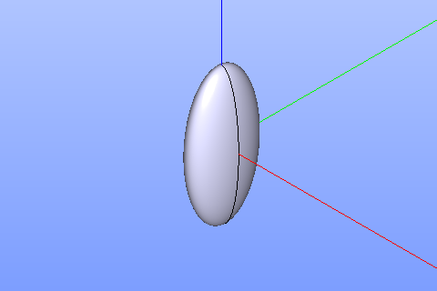

Ellipsoid
=========

To create a Ellipsoid in the active part:

#. select in the Main Menu *GDML - > Ellipsoid* item  or
#. click **Ellipsoid** button in the toolbar.

.. centered::
   **Ellipsoid**  button 

The following property panel will be opened:

	
.. centered::
   **Ellipsoid property panel**

**TUI Command**:  *model.addEllipsoid(Part_doc, 10, 20, 40)*
  
**Arguments**:    Part + ax + by + cz.

The Result of the operation will be a SOLID.

		   
.. centered::
   Ellipsoid created

**See Also** a sample TUI Script of a :ref:`tui_create_ellipsoid` operation.
