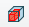
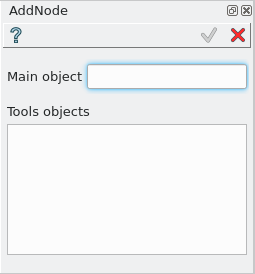
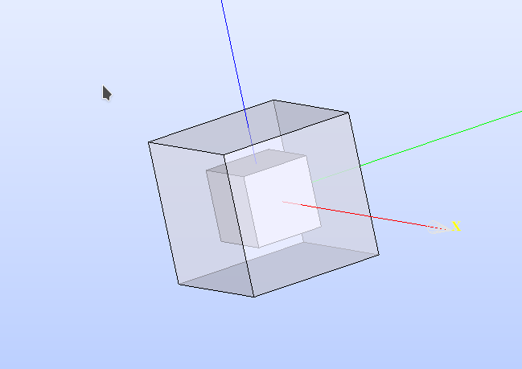

AddNode
------

AddNode feature perform an AddNode operation used in bulding the ROOT geometrical hierarchy.

To create a AddNode in the active part:

#. select in the Main Menu *Opera - > AddNode* item  or
#. click |AddNode_button.icon| **AddNode** button in the toolbar:

AddNode is created by a solid as main object and a tool object

Input fields:

- **MainOject** defines the solid main object;
- **Tool** defines the tool object

**TUI Command**:

.. py:function::
    model.addAddNode(Part_doc, model.selection("SOLID", main_object_name), model.selection("SOLID", main_object_name))

    :param part: The current part object.
    :param object: A main object solid.
    :param object: A tool object solid.
    :return: Result compound.

Result
""""""

One compound with the boolean operation result and the tools objects used on the geometry below it. Depends on geometry cases

   AddNode created

**See Also** a sample TUI Script of :ref:`tui_create_addnode` operation.
