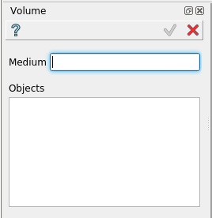

.. |Volume_button.icon|    image:: images/Volume_button.png

Volume
------

Volume feature creates a basic object used in bulding the ROOT geometrical hierarchy.

To create a Volume in the active part:

#. select in the Main Menu *Opera - > Volume* item  or
#. click |Volume_button.icon| **Volume** button in the toolbar:

Volume is created by a value and a list of solids

Input fields:

- **Medium** defines the name of the medium;
- **Objects** defines the list of solid objects

**TUI Command**:

.. py:function::
    model.addVolume(Part_doc, medium, model.selection[("SOLID", ...), ...])

    :param part: The current part object.
    :param string: A medium name.
    :param list: A list of solids.
    :return: Result object.

Result
""""""

One solid for each selected solid in the volume list with according medium

.. figure:: images/Volume1.png
   :align: center

   Volume created

**See Also** a sample TUI Script of :ref:`tui_create_volume` operation.
