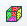
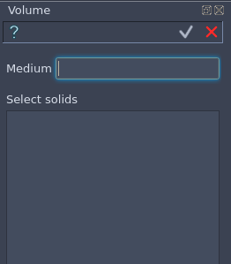
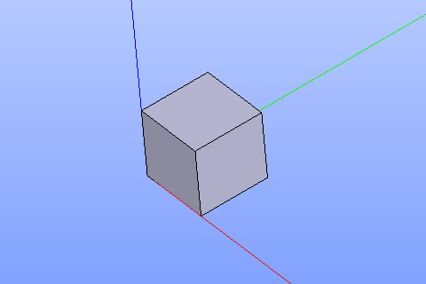

Volume feature creates a box solid.

To create a Volume in the active part:

#. select in the Main Menu *Opera - > Volume* item  or
#. click |Volume_button.icon| **Volume** button in the toolbar:

--------------------------------------------------------------------------------

by Medium and Solids
-------------

Volume is created by a Medium value and a list of solids

Input fields:

- **MEDIUM**, **VOLUME_LIST** define medium and shapes of the volume.

**TUI Command**:

.. py:function:: model.addVolume(Part_doc, MEDIUM, VOLUME_LIST)

    :param part: The current part object.
    :param real: Medium name.
    :param real: List of solids.
    :return: Result object.

Result
""""""

One solid for each selected solid in the volume list with according medium

