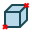

Box
===

The feature Box lets to create a solid of a box shape.

To create a Box in the active part:

#. select in the Main Menu *Primitives - > Box* item  or
#. click **Box** button in the toolbar:

.. centered::
   **Box**  button 

There are 2 algorithms for creation of a Box:

**By dimensions** creates a box by dimensions along X, Y, Z axis.

**By two points** creates a box by two points of the box diagnal.

By dimensions
"""""""""""""

.. image:: images/Box_dimensions.png
   :align: center

In this case it is necessary to specify **DX**, **DY**, **DZ** sizes of the box along corresponded coordinate axes. The box will be created starting from the origin.

**TUI Command**:  *model.addBox(Part_doc, DX, DY, DZ)*
  
**Arguments**:    1 Part + 3 values (dimensions at origin).

By two points
"""""""""""""

.. image:: images/Box_2points.png
	 :align: center

In this case it is necessary to select **Point 1** and **Point 2** to define a diagonal points of the box.
  
**TUI Command**:  *model.addBox(Part_doc, FirstPoint, SecondPoint)*

**Arguments**:   1 Part + 2 selected points (opposite vertices of the box)

Result
""""""

The Result of operation will be a SOLID. The edges of the box will be parallel to the coordinate axes.

Name is assigned automatically:
    
* **Box_1**, **Box_2**, ... to Feature;
* **Box_1_1**, **Box_2_1**, ... to Result.

Example is shown below.

.. image:: images/Boxes.png
	   :align: center
		   
.. centered::
   Boxes created  

**See Also** a sample TUI Script of a :ref:`tui_create_box` operation.
