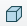
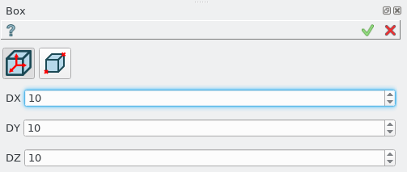
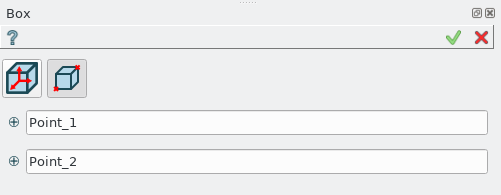

Box
===

To create a Box in the active part:

#. select in the Main Menu *Primitives - > Box* item  or
#. click **Box** button in the toolbar

.. centered::
   **Box**  button 

There are 2 algorithms for creation of a Box:

	
.. centered::
   **By dimensions**

and 

		   
.. centered::
   **By two points**  

The description of input fields for **By dimensions** tab is given below:

- **DX**, **DY**, **DZ** specify box dimensions along the coordinate axes for box with corner coinciding with coordinate origin.

The description of input fields for **By two points** tab is given below:

- **Point 1** and **Point 2** define the opposite corners of the box.

**Apply** button creates box with defined parameters.
  
**Cancel** button cancels operation. 

The Result of operation will be a SOLID. The edges of the box will be parallel to the coordinate axes.

Name is assigned automatically:
    
* **Box_1**, **Box_2**, ... to Feature;
* **Box_1_1**, **Box_2_1**, ... to Result.

**See Also** a sample TUI Script of a :ref:`tui_create_box` operation.
