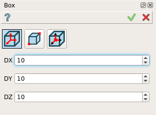
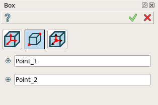

Box
===

To create a Box in the active part:

#. select in the Main Menu *Primitives - > Box* item  or
#. click **Box** button in the toolbar

.. image:: images/Box_button.png
   :align: center

.. centered::
   **Box**  button 

There are 2 algorithms for creation of a Box:

	
.. centered::
   **By dimensions**

and 

		   
.. centered::
   **By two points**  

The description of input fields for **By dimensions** tab is given below:

- **DX**, **DY**, **DZ** specify box dimensions along the coordinate axes for box with vertex coinciding with coordinate origin.

**TUI Command**:  *model.addBox(Part_doc, DX, DY, DZ)*
  
**Arguments**:    1 Part + 3 values (dimensions at origin).

The description of input fields for **By two points** tab is given below:

- selected **Point 1** and **Point 2** define the opposite vertices of the box.
  
**TUI Command**:  *model.addBox(Part_doc, FirstPoint, SecondPoint)*

**Arguments**:   1 Part + 2 selected points (opposite vertices of the box)

The Result of operation will be a SOLID. The edges of the box will be parallel to the coordinate axes.

Name is assigned automatically:
    
* **Box_1**, **Box_2**, ... to Feature;
* **Box_1_1**, **Box_2_1**, ... to Result.

Example is shown below.

.. image:: images/Boxes.png
	   :align: center
		   
.. centered::
   Boxes created  

**See Also** a sample TUI Script of a :ref:`tui_create_box` operation.
