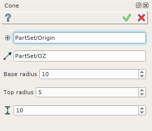
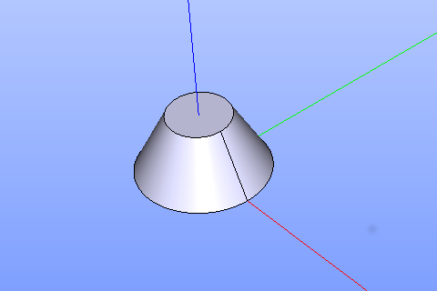

Cone
====

To create a Cone in the active part:

#. select in the Main Menu *Primitives - > Cone* item  or
#. click **Cone** button in the toolbar

.. centered::
   **Cone** button 

The following property panel appears.

.. centered::
   Cone property panel

The description of input fields is given below:

-  selected **Point** defines center of the cone base;
-  selected **Vector** defines the axis of the cone;
- Dimensions:      
   - **Base Radius**;
   - **Top radius**;  
   - **Height**.
  
**Apply** button creates cone with defined parameters.
  
**Cancel** button cancels operation.

**TUI Command**: *model.addCone(Part_doc, Point, Axis, Radius1, Radius2, Height)* 

**Arguments**:  1 Part + 1 vertex + 1 vector + 3 values (Dimensions: base and top radii, heght).

The Result of operation will be a SOLID.

If both radii are non-zero, then the cone will be truncated.

If the radii are equal, the Cylinder will be created instead of cone.

Name is assigned automatically:
    
* **Cone_1**, **Cone_2**, ... to Feature;
* **Cone_1_1**, **Cone_2_1**, ... to Result.

Example is shown below.

		   
.. centered::
   Sphere created  

**See Also** a sample TUI Script of a :ref:`tui_create_cone` operation.
