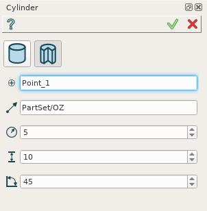

Cylinder
========

To create a Cylinder in the active part:

#. select in the Main Menu *Primitives - > Cylinder* item  or
#. click **Cylinder** button in the toolbar

.. centered::
   **Cylinder** button 

There are 2 algorithms for creation of a Cylinder:

.. image:: images/Cylinder.png
   :align: center
	
.. centered::
   **Cylinder**

and 

		   
.. centered::
   **Portion of cylinder**  

The description of input fields for **Cylinder** tab is given below:

- selected **Point** defines center of the cylinder base;
- selected **Vector** defines the axis of the cylinder;
- Dimensions:      
   - **Radius**;
   - **Height**.    

Input fields for ***Portion of cylinder** tab includes in addition **Angle** to create a portion of cylinder.

**TUI Commands**:

* *model.addCylinder(Part_doc, Point, Axis, Radius, Height)*
* *model.addCylinder(Part_doc, Point, Axis, Radius, Height,Angle)*
  
**Arguments**:   1 Part + 1 vertex +1 vector +  2 or 3 values (dimensions: radius, height and angle).

The Result of operation will be a SOLID.

Name is assigned automatically:
    
* **Cylinder_1**, **Cylinder_2**, ... to Feature;
* **Cylinder_1_1**, **Cylinder_2_1**, ... to Result.

Example is shown below.

.. image:: images/Cylinders.png
	   :align: center
		   
.. centered::
   Cylinders created  

**See Also** a sample TUI Script of a :ref:`tui_create_cylinder` operation.
