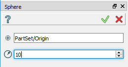
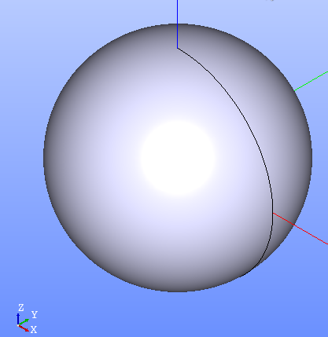

Sphere
======

To create a Sphere in the active part:

#. select in the Main Menu *Primitives - > Sphere* item  or
#. click **Sphere** button in the toolbar

.. centered::
   **Sphere** button 

The following input panel appears.

.. centered::
   Sphere input panel
   
The description of input fields is given below:

- **Point** defines center of the sphere; 
- **Radius** defines the radius.
  
**Apply** button creates sphere with defined parameters.
  
**Cancel** button cancels operation.

**TUI Command**: *model.addSphere(Part_doc, Point, Radius)*.

**Arguments**:   Name + 1 Part + 1 vertex +1 value (radius).

The Result of operation will be a SOLID.

Name is assigned automatically:
    
* **Sphere_1**, **Sphere_2**, ... to Feature;
* **Sphere_1_1**, **Sphere_2_1**, ... to Result.

Example is shown below.

		   
.. centered::
   Sphere created  

**See Also** a sample TUI Script of a :ref:`tui_create_sphere` operation.
