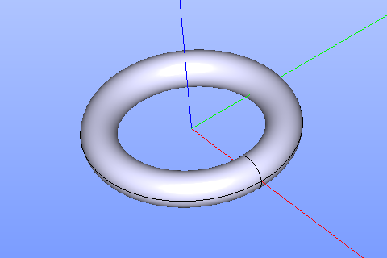

Torus
=====

The feature Torus creates a torus solid.

To create a Torus in the active part:

#. select in the Main Menu *Primitives - > Torus* item  or
#. click **Torus** button in the toolbar

.. centered::
   **Torus** button 

The following property panel appears.

.. centered::
   Torus

 The description of input fields is given below:

-  selected **Point** defines center of the torus;
-  selected **Vector** defines the axis of the torus;
- Dimensions:      
   - **Radius**;
   - **Ring radius**.
  
**TUI Command**: *model.addTorus(Part_doc, Point, Axis, Radius1, Radius2)*

**Arguments**:  1 Part + 1 vertex + 1 vector + 2 values (Dimensions: first and second radii).

Result
""""""

The Result of operation will be a SOLID.

Name is assigned automatically:
    
* **Torus_1**, **Torus_2**, ... to Feature;
* **Torus_1_1**, **Torus_2_1**, ... to Result.

Example is shown below.

		   
.. centered::
   Torus created  

**See Also** a sample TUI Script of a :ref:`tui_create_torus` operation.
  
