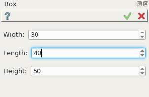
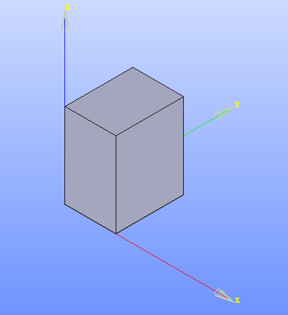

Box
===

Custom feature box is located at ..\sources\src\PythonAddons\macros\box.

.. literalinclude:: examples/box/feature.py   
    :linenos:
    :language: python

:download:`Download this script <examples/box/feature.py>`

.. literalinclude:: examples/box/widget.xml    
    :linenos:
    :language: html

:download:`Download this script <examples/box/widget.xml>`

The feature Box creates a box solid by extrusion of rectangle.

Result in Shaper module is described below.

To create a Box in the active part:

#. select in the Main Menu *Macros - > Box* item  or
#. click **Box** button in the Macros toolbar:

.. image:: images/box.png
   :align: center

.. centered::
   **Box**  button 

The following property panel appears. 

.. centered::
  Create a box

Input fields: 

- **DX**, **DY**, **DZ** sizes of the box along corresponded coordinate axes. The box will be created starting from the origin.   

Result
""""""

The Result of operation will be a SOLID. The edges of the box will be parallel to the coordinate axes.

Name is assigned automatically:
    
* **Box_1**, **Box_2**, ... to Feature;
* **Box_1_1**, **Box_2_1**, ... to Result.

Example is shown below.

		   
.. centered::
   Box created  
