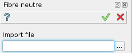

.. _create_fibreNeutre:
.. |fibreNeutre.icon|    image:: images/fibreNeutre.png

Fibre neutre
============

FIbre neutre is a macro-feature and can not be edited after execution.
It allows creation of several parameters basing on variables-values file.

To import parameters:

#. select in the Main Menu *Macros - > Fibre neutre* item  or
#. click |fibreNeutre.icon| **Fibre neutre** button in Macros toolbar:

The following property panel appears:

   Fibre neutre

Result
""""""

The surfaces are built.
