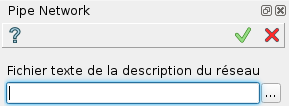

.. _pipeNetwork:
.. |pipeNetwork.icon|    image:: images/pipeNetwork.png

Réseau de tuyaux
================

Cette macro crée les objets SHAPER correspondant à un réseau de tuyauteries décrit dans un fichier texte.

Pour créer l'objet de la tuyauterie :

#. Choisir dans le menu principal *Macros - > Réseau de tuyaux* item  ou
#. cliquer le bouton |pipeNetwork.icon| **Réseau de tuyaux** dans la barre des macros.

Le menu suivant apparaît :

   Réseau de tuyaux

On doit fournir le fichier de type texte qui contient le réseau. Sa syntaxe est décrite plus bas.

Syntaxe du fichier de données
"""""""""""""""""""""""""""""
