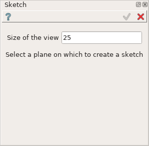
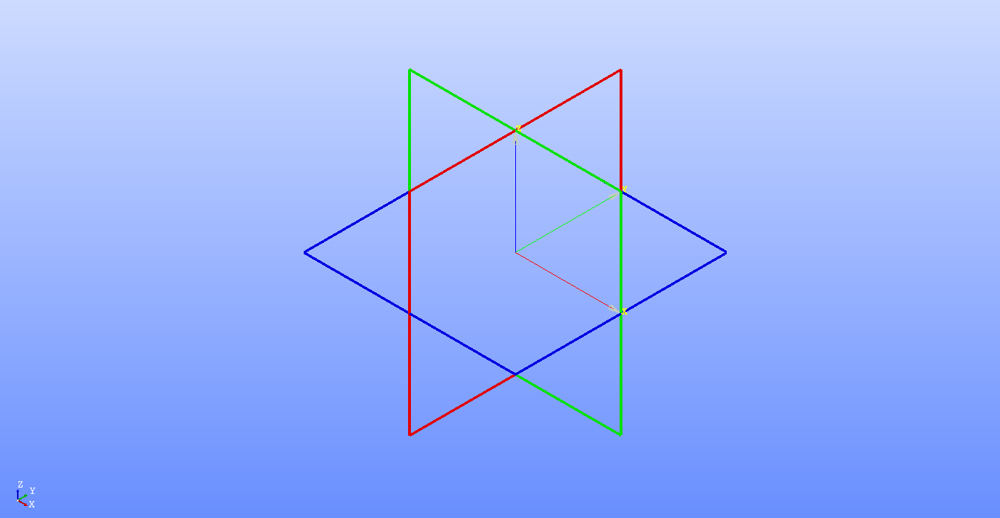
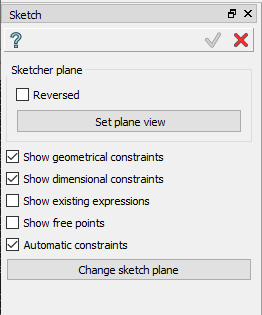

.. _sketchPlugin:

Sketch plug-in
================

Sketch plug-in includes features for creation of 2D shapes.

The process of sketch creation is comprised of:

- definition of sketch plane
- creation of sketch objects from scratch
- generation of sketch objects via operations on the existing operations
- definition of constraints

Sketch could be created both in active part and a part set (if there is no active part).

To create a Sketch:

#. select in the Main Menu *Sketch - > Sketch* item  or
#. click **Sketch** button in Sketch toolbar:

.. centered::
   **Sketch**  button

First define a plane on which to create a sketch:

- specify plane size (equal to 25 in the example above)
- then select the appropriate plane in the viewer

Note that in case if there are no convenient objects for plane selection are
displayed in the viewer - coordinate planes will be suggested for selection:

After the plane for sketch is selected the following property panel will be opened:

.. centered::
  Sketch general panel

- **Reversed** check box - allows reversing the sketch plane normal
- **Set plane view** button - switches the viewer to the top view for the sketch plane
- **Show geometrical constraints** check box - turns on/off geometrical constraints displaying
- **Show dimensional constraints** check box - turns on/off dimensional constraints displaying
- **Show existing expressions** check box - turns on/off expressions displaying

Now it is possible:

- create :ref:`sketch objects <sketch_objects>`
- create :ref:`constraints <sketch_constraints>`
- perform :ref:`sketch operations <sketch_operations>`

To apply or cancel sketch creation use apply and cancel buttons from the
Sketch panel as well as equivalent buttons from Sketch toolbar.

The Result of operation will be a COMPOUND. Result node in the object tree is located in
**Constructions** folder.

Name is assigned automatically: **Sketch_1**, **Sketch_2**, ... both for Feature and Result.

**TUI Command**:  *Sketch_1 = model.addSketch(PartOrPartSet, plane)*

**Arguments**:    Part or PartSet + plane.

.. _sketch_objects:

Sketch objects
--------------

The plug-in includes following features for creation of 2D objects:

.. toctree::
   :maxdepth: 1

   pointFeature.rst
   lineFeature.rst
   rectangleFeature.rst
   circleFeature.rst
   arcFeature.rst

.. _sketch_constraints:

Constraints
-----------

.. toctree::
   :maxdepth: 1

   distanceFeature.rst
   horizontalDistFeature.rst
   angleFeature.rst
   coincedenceFeature.rst
   collinearFeature.rst
   equalFeature.rst
   horizontalFeature.rst
   lengthFeature.rst
   middleFeature.rst
   parallelFeature.rst
   perpendicularFeature.rst
   radiusFeature.rst
   rigidFeature.rst
   tangentFeature.rst
   verticalDistFeature.rst
   verticalFeature.rst

.. _sketch_operations:

Operations
----------

.. toctree::
   :maxdepth: 1

   filletFeature.rst
   splitFeature.rst
   trimFeature.rst
   intersectionFeature.rst
   mirrorFeature.rst
   projectionFeature.rst
   rotationFeature.rst
   translationFeature.rst
