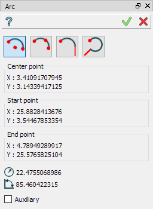
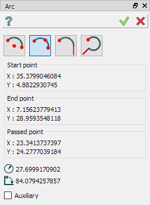
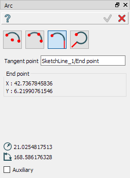

Arc
===

The feature Arc creates an arc segment in the current Sketch.

To add new Arc to the Sketch:

#. select in the Main Menu *Sketch - > Arc* item  or
#. click **Arc** button in Sketch toolbar:

.. centered::
   **Arc**  button

There are 3 algorithms for creation of an Arc:

**By center and two points** creates an arc segment with the given center passing from the start point to the end point on the circumference.

.. image:: images/arc_3pt_32x32.png
   :align: left
**By three points** creates an arc segment passing from the start point to end point through another point on the circumference.

**By tangent and point** creates an arc segment with the tangent point and the end point.

By center and two points
""""""""""""""""""""""""

**TUI Command**:  *Sketch_1.addCircle(CenterX, CenterY, StartX, StartY, EndX, EndY, Inversed)*

**Arguments**:    7 values (coordinates of the center, the start, the end, inversed flag (if true - build arc from end to start)).

By three points
"""""""""""""""

**TUI Command**:  *Sketch_1.addCircle(StartX, StartY, EndX, EndY, PassedX, PassedY)*

**Arguments**:    6 values (coordinates of the start, end and passed points).

By tangent and point
""""""""""""""""""""

**TUI Command**:  *Sketch_1.addCircle(TangetPoint, EndX, EndY, Inversed)*

**Arguments**:    4 values (reference to tangent point, coordinates of end point, inversed flag (if true - build arc from end to start)).