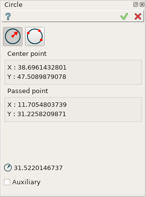
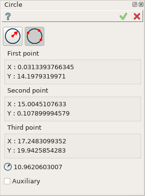

Circle
======

The feature Circle creates a circle in the current Sketch.

To add new Circle to the Sketch:

#. select in the Main Menu *Sketch - > Circle* item  or
#. click **Circle** button in Sketch toolbar:

.. centered::
   **Circle**  button

There are 2 algorithms for creation of a Circle:

**By center and passed point** creates a circle with the given center passing through the given point.

**By three points** creates a circle passing through the given three points.

By center and passed point
""""""""""""""""""""""""""

Click in the view once to set the center point, then move the mouse and click a second time to set the passed point.

**TUI Command**:  *Sketch_1.addCircle(CenterX, CenterY, PassedX, PassedY)*

**Arguments**:    4 values (coordinates of the center and the passed point).

By three points
"""""""""""""""

Click in the view once to set the first passed point, then move the mouse and click a second time to set the second passed point
and finally move the mouse and click a third time to set the last passed point.

**TUI Command**:  *Sketch_1.addCircle(X1, Y1, X2, Y2, X3, Y3)*

**Arguments**:    6 values (coordinates of three points).
