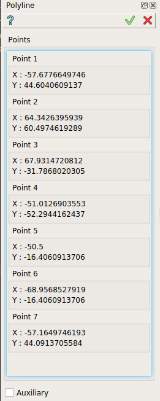
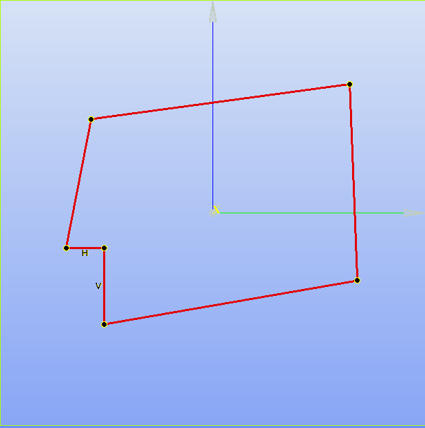

.. _SketchPolyline:
.. |polyline.icon|    image:: images/polyline.png

Polyline
========

Polyline feature creates polyline in the current Sketch.

To add a new Polyline to the Sketch:

#. select in the Main Menu *Sketch - > Polyline* item  or
#. click |polyline.icon| **Polyline** button in Sketch toolbar:

The following property panel appears:

   Polyline

Pick points in the view to create a Line.  

Start and end points coordinates are displayed in the property panel.

Result
""""""

Created line appears in the view.

   Polyline created
